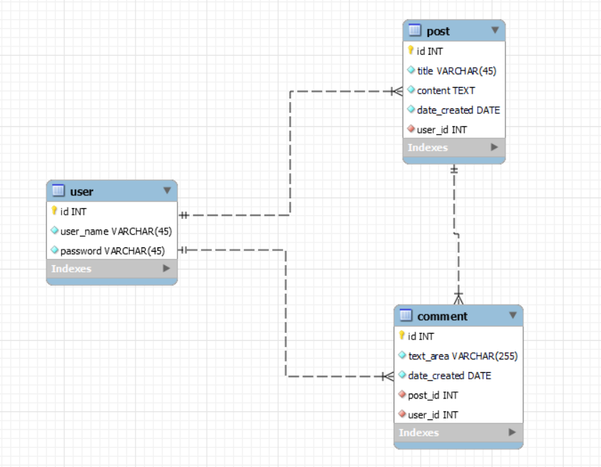
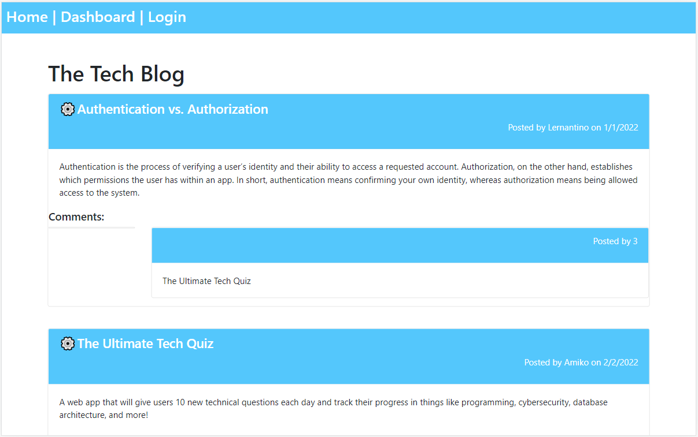
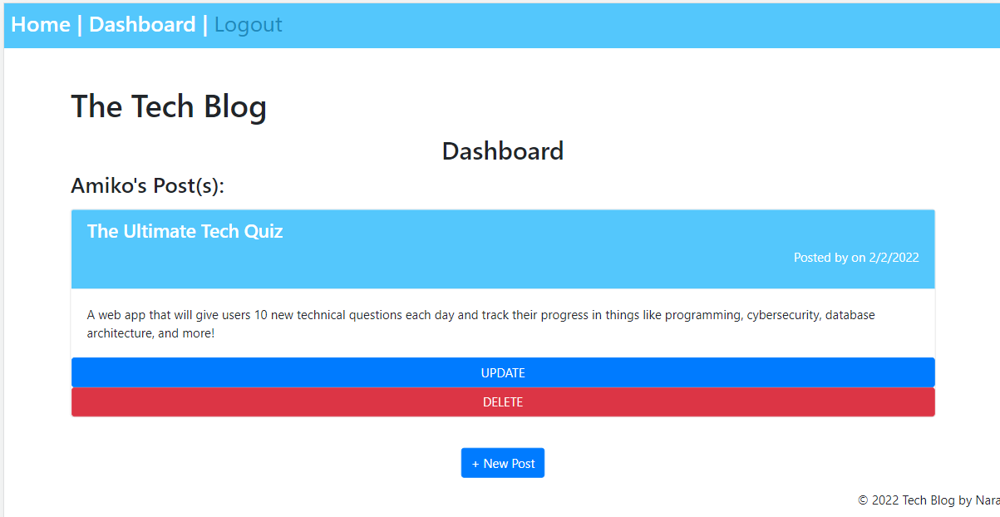
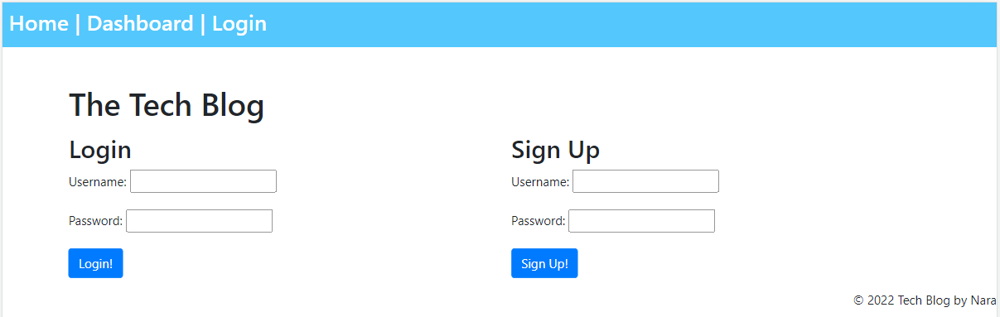
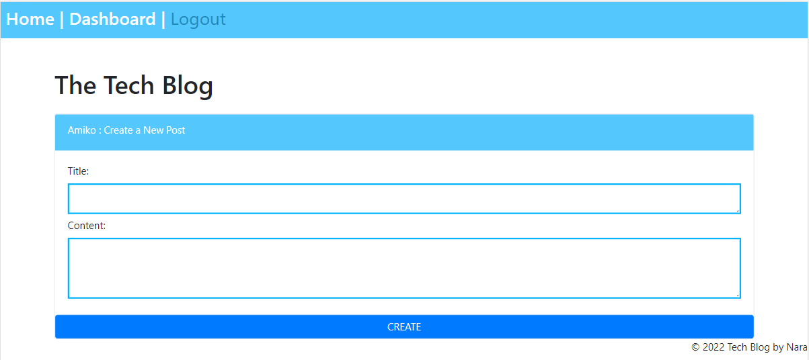
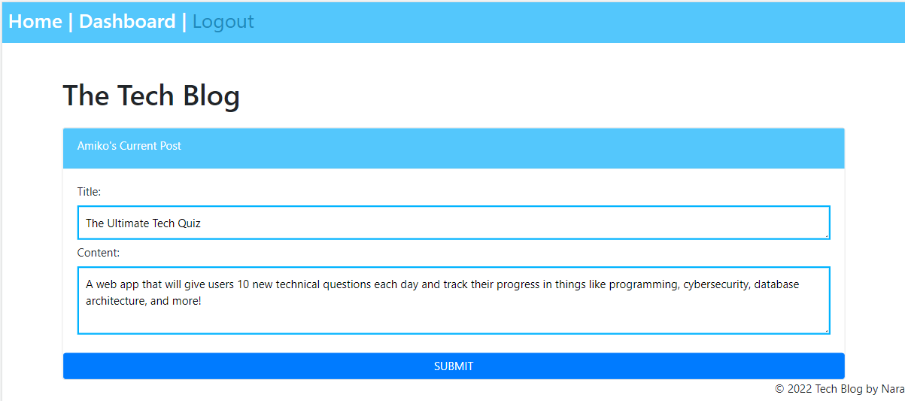
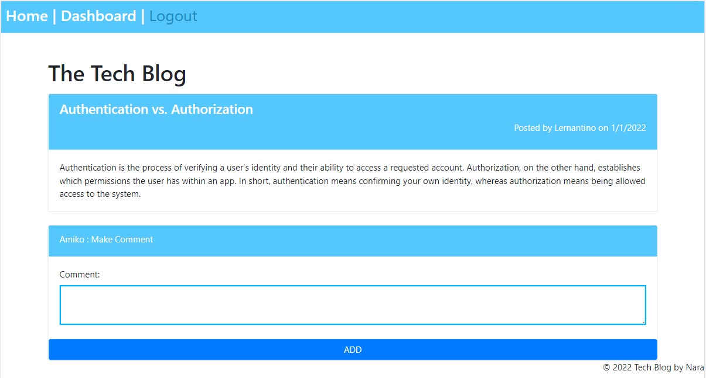
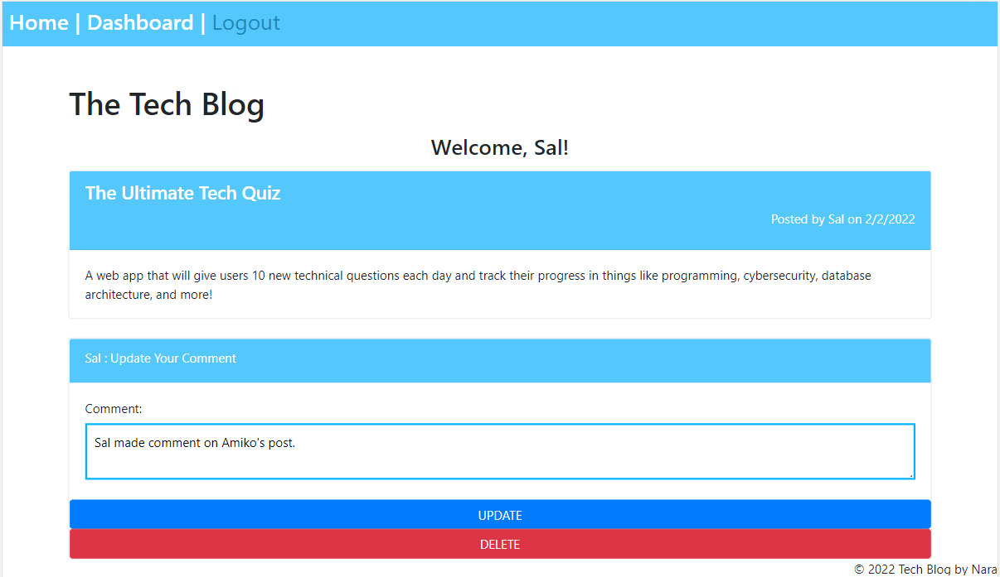

# mvc-tech-blog

Bootcamp Week 14: Homework

# 14 Model-View-Controller (MVC): Tech Blog

## Table of Contents 

- [About Task](#about-task)
- [User Story](#user-story)
- [Getting Started](#getting-started)
- [Database Models](#database-models)
- [My Solution](#my-solution)
- [Live](#live)

## About Task

The purpose of the task is to build a CMS-style blog site similar to a Wordpress site, where developers can publish their blog posts and comment on other developers’ posts as well. This app must follow the MVC paradigm in its architectural structure, using Handlebars.js as the templating language, Sequelize as the ORM, and the express-session npm package for authentication. I built this site completely from scratch and deployed it to Heroku.

## User Story

```md
AS A developer who writes about tech
I WANT a CMS-style blog site
SO THAT I can publish articles, blog posts, and my thoughts and opinions
```

## Getting Started

This application’s folder structure follows the Model-View-Controller paradigm. This application uses the following packages and dependencies: 
- [express-handlebars](https://www.npmjs.com/package/express-handlebars) package to implement Handlebars.js for the `Views`
- [MySQL2](https://www.npmjs.com/package/mysql2) and [Sequelize](https://www.npmjs.com/package/sequelize) packages to connect to a MySQL database for the `Models`
- Express.js API for the `Controllers`
- [dotenv package](https://www.npmjs.com/package/dotenv) to use environment variables
- [bcrypt package](https://www.npmjs.com/package/bcrypt) to hash passwords
- [express-session](https://www.npmjs.com/package/express-session) and [connect-session-sequelize](https://www.npmjs.com/package/connect-session-sequelize) packages to add authentication.

**Note**: The [express-session](https://www.npmjs.com/package/express-session) package stores the session data on the client in a cookie. When the client is idle on the site for more than a set time, the cookie will expire and the user will be required to log in again to start a new session. 

If you need this app repo on your computer, it is required to install all necessary dependencies.

- First clone the repository
- Rename `.env.example` to `.env` and then add your values for each environment variable in the file
- `npm i`             // to install the dependencies
- `npm run seed`      // if applicable
- `nmp start`         // to invoke the application

Because this app is deployed to Heroku, the seed command is run already for testing purposes. 

## Database Models

The database name: `blog_db` contains the following three tables:

- User
- Post
- Comment

The database structure is shown in the following image:



### Associations

The Sequelize models execute the following relationships using association methods:

* `Post` belongs to `User`, and `User` has many `Post` models, as a user can have multiple posts but a post can only belong to one user.

* `Comment` belongs to `User`, and `User` has many `Comment` models, as a user can have multiple comments but comment can only belong to one user.

* `Comment` belongs to `Post`, and `Post` has many `Comment` models, as a post can have multiple comments but comment can only belong to one post.

## My Solution

For the first time, this CMS-style blog site is presented with the homepage, which includes existing blog posts with comments; navigation links for the homepage and the dashboard; and the option to log in.

The homepage option is clicked the user is taken to the homepage. But any other links in the navigation are clicked the user is redirected to either login or sign up.

For the first-time user, the Sign-Up is recommended. When the user chooses to sign up, the user needs to enter a username and password. The sign-up button is clicked the user credentials are saved and logged into the site.

If the user revisits the site later and chooses to log in, the user re-enters their username and password. When the user is logged in to the site, he/she can see navigation links for the homepage, the dashboard, and the option to log out.

Once the user is logged in the following functions are able to perform:

The homepage is presented with existing blog posts that include the post title and the date created, additionally, "Add Comment" button can be shown after each post. The logged user is able to leave a comment on any post. This part was the challenging part of the task. So I added some script in `homepage.handlebars` to solve this problem.

When an existing blog post is clicked, it navigates to `post.handlebars`. The post view is presented with the post title, contents, post creator’s username, and date created for the post and has the option to leave a comment. If the user is not logged in, "Add Comment" button is not shown on the screen.

If a user leaves a comment and clicks on the submit button while signed in, the comment is saved and the post is updated to display with the comment, the comment creator’s username, and the date created.

The dashboard option in the navigation is clicked, and the user is taken to the dashboard and presented with all the blog posts he/she has already created and the option to add a new blog post.

If the user wants to add a new blog post, the user is directed to `create.handlebars` to enter both a title and contents for the blog post. Then those inputs are saved in the database, the user is taken back to an updated dashboard with the new blog post.

Also, the user is able to delete or update his/her own existing posts in the dashboard, and taken back to an updated dashboard.

If the user is clicked on the logout option in the navigation, the user is signed out of the site. When the user is idle on the site for more than a set time, then the user is able to see posts with comments, but he/she needs to log in again to add, update, or delete posts and add comments.

The following schema gives a visual picture of this application flow with MVC paradigm:

```                      
Tech Blog
|
blog_db database - Model               Controller         View  
|
├── /          root route              homeRoutes.js
│   ├── /homepage                                         homepage.handlebars
│   ├── /post/:id                                         post.handlebars  
│   ├── /login                                            login.handlebars
│   ├── /dashboard                                        dashboard.handlebars
│   ├── /create/:id                                       create.handlebars     
│   ├── /update/:id                                       update.handlebars
│   ├── /comment/:id                                      comment.handlebars
│   └── /change/:id                                       change.handlebars
├── /api/users                         userRoutes.js              
│   ├── POST  adding a new user           
│   ├── POST  checking existing user                      /api/users/login          
│   └── POST  ends user's login                           /api/users/logout 
├── /api/posts                         postRoutes.js                  
│   ├── GET   READ posts              
│   ├── GET   READ post By ID   
│   ├── POST  CREATE post               
│   ├── PUT   UPDATE post By ID               
│   └── DEL   DELETE post By ID
└──/api/comments                       commentRoutes.js
    ├── POST  CREATE comment
    ├── DEL   DELETE comment By ID  
    ├── GET   READ comment By ID                            
    └── GET   READ comments
```

## Live

This application is deployed to Heroku.com. Here is a link to the deployed website. [Heroku](https://the-tech-blog-mvc-structure.herokuapp.com/)

The following image shows the deployed HTML’s appearance: 

If you have any questions about the repo, open an issue or contact me directly at naraamtm@gmail.com. Here is a link to this application repo on [GitHub](https://github.com/Nara1469/mvc-tech-blog).

The following images show some of the `Views` screenshots: 
- DASHBOARD 
- LOGIN/SIGNUP 
- Create a new post 
- Update an existing post 
- Add a comment 
- Update/Delete a comment 